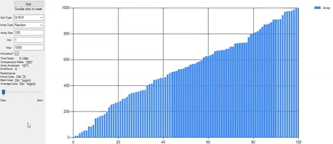
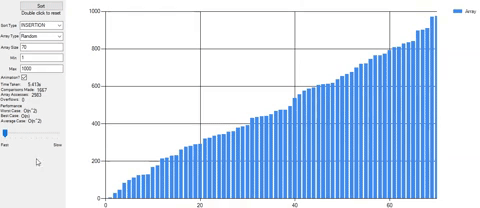

# Some sorts Graphed

Currently, a small program I wrote back in 2015 which implemented as many sorts as I knew of at the time and displayed each major step on a bar graph.
Written using visual studio so the code needs refactoring and cleaning but the program works. Also was my first real use of threading which is a laughbly bad
implementation of moving work onto another thread.

This was my first real project so the code is definitely not the best, or the cleanest. And horrifyingly enough
its all in 1 file. But it works (sort of) and was a good learning experience. Luckily I longer
work with VB anymore but this is good to look back on :)

## Sample usages:

Quick Sort:  
   

Insertion Sort:  

## Current Sorts:

* Intro
* Quick
* Merge
* Count
* Heap
* Radix
* Bucket
* Selection
* Insertion
* Binary Insertion
* Comb
* Shell

### Current Bad Sorts:

* Cocktail
* Bubble
* Slow
* Gnome
* Bozo
* Bogo
    